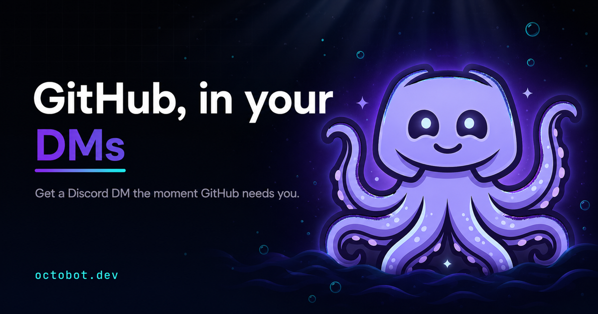

<div align="center">
  

  # OctoBot

  **GitHub, in your DMs.**

  [](LICENSE)
  [](CONTRIBUTING.md)
  [](https://discord.gg/dfJPuhDGu6)
  [](https://octobot.dev)
</div>

---

## What is OctoBot

OctoBot is a Discord bot that DMs you the moment something on GitHub needs your attention — review requests, mentions, CI failures, approvals — across **every repository your account can access**, public and private. One click to connect, no per-repository setup, no webhooks to configure.

## Why you can trust it

- **Strictly read-only** — OctoBot reads your notifications to tell you about them; it never marks them read or writes to a repo.
- **Encrypted at rest** — your GitHub token is sealed with **AES-256-GCM**; the key lives only in the environment and is never logged.
- **CSRF-safe OAuth** — every authorization link carries a single-use `state` that expires after ten minutes.
- **Least logging** — only IDs, statuses, and errors are recorded, never tokens, secrets, or message contents.
- And it's open source — every line is public, audit it yourself.

## Get started

1. Join the [OctoBot Discord community](https://discord.gg/dfJPuhDGu6) — this gives you a mutual server with the bot, which lets it DM you.
2. Run `/link` and click the authorization link to connect your GitHub account.

That's it — OctoBot starts DMing you the moment something needs your attention.

## Commands

| Command | What it does |
| --- | --- |
| `/link` | Get a personal GitHub authorization link — click it to connect your account. |
| `/status` | See your connected login plus what needs your review right now, fetched live. |
| `/listen-to` | Pick which notification types and reasons you receive. Saves the instant you change it. |
| `/digest` | Turn the daily PR digest on or off, or preview it immediately. |
| `/connect-token` | Connect with a Personal Access Token instead — for accounts behind org OAuth restrictions. |
| `/unlink` | Disconnect your account and erase everything OctoBot stores about you. |

## Architecture

Monorepo managed with pnpm workspaces and Turborepo:

```
apps/
  bot/             Discord bot + notification service (Node, TypeScript, discord.js v14, Fastify v4, better-sqlite3)
  landing-page/    Marketing site at octobot.dev (Next.js 16, React 19, Tailwind CSS v4)
packages/          Shared packages
```

A background **poller** checks each connected account's GitHub notifications about once a minute, using conditional requests so unchanged checks stay cheap. New activity is filtered against your `/listen-to` subscription, enriched with PR review verdicts, deduplicated per thread, and DMed to you.

## Contributing

Contributions are welcome — bug fixes, features, and docs improvements alike. See [CONTRIBUTING.md](CONTRIBUTING.md) for the full guide. To get a local dev environment running:

```bash
pnpm install
pnpm dev
```

## Community · License · Disclaimer

Join us on [Discord](https://discord.gg/dfJPuhDGu6).

Licensed under [MIT](LICENSE).

Not affiliated with or endorsed by GitHub, Inc. or Discord Inc.
